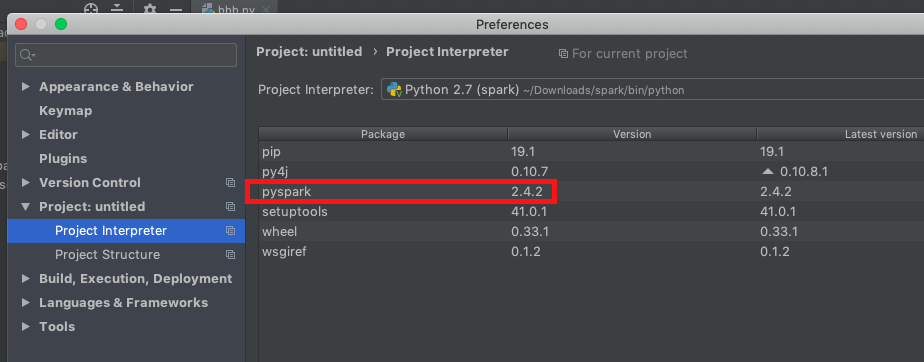
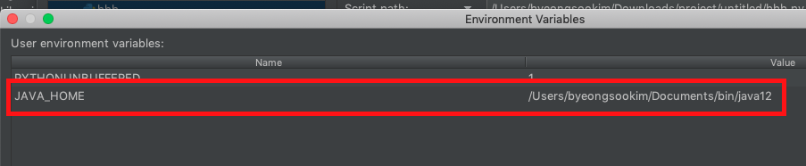

# Overview
PySpark on PyCharm

# Environments
* macOS Mojave 10.14.4 
* PyCharm Community 2019.1 
* PySpark 2.4.2  
* Oracle Java 12 
* Python 2.7.10 

# PyCharm setup
1. Python Interpreter

2. Environment Variables

