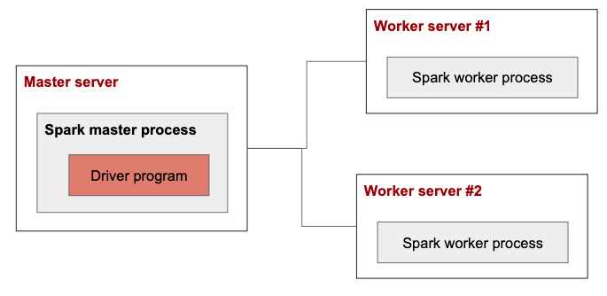

# Environments
* All machines(master and slave machines)<br>
  * Ubuntu 18.04<br>
  * OpenJDK 1.8<br>
  * Python 2.7<br>
  * Spark 2.4<br>

# Overview
<br>
I'll submit the wordcount application on master machine<br>
So the driver program runs on master machine<br>
(2018.04.29) At this time, Standalone supports only client mode for python<br>


# Standalone
### 1. Download Spark
https://spark.apache.org/downloads.html

### 2. Start master
```shell
vanryuji@spark-master:~/spark-2.4.2-bin-hadoop2.7$ ./sbin/start-master.sh 
starting org.apache.spark.deploy.master.Master, logging to /home/vanryuji/spark-2.4.2-bin-hadoop2.7/logs/spark-vanryuji-org.apache.spark.deploy.master.Master-1-spark-master.out
```

```shell
# Spark master url is spark://spark-master.asia-northeast1-b.c.supple-flux-235902.internal:7077
# It's used for connecting to master by worker(slave)

vanryuji@spark-master:~$ cat spark-2.4.2-bin-hadoop2.7/logs/spark-vanryuji-org.apache.spark.deploy.master.Master-1-spark-master.out
...
19/04/29 06:14:06 INFO Master: Starting Spark master at spark://spark-master.asia-northeast1-b.c.supple-flux-235902.internal:7077
...
```

### 3. Start worker(slave)
```shell
vanryuji@spark-master:~/spark-2.4.2-bin-hadoop2.7$ ./sbin/start-slave.sh spark://spark-master.asia-northeast1-b.c.supple-flux-235902.internal:7077
```

### 4. Submit application on master process machine
```shell
./bin/spark-submit --master spark://spark-master.asia-northeast1-b.c.supple-flux-235902.internal:7077 examples/src/main/python/wordcount.py examples/src/main/python/transitive_closure.py
```
