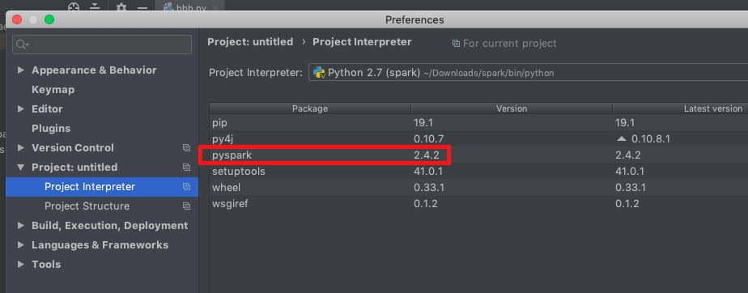
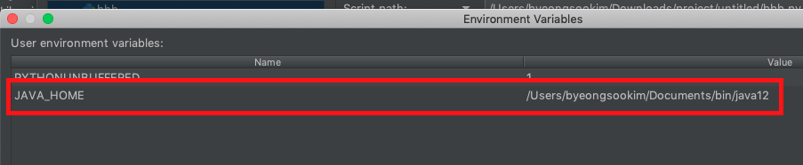

PySpark on PyCharm

# Environments
* macOS Mojave 10.14.4 
* PyCharm Community 2019.1 
* PySpark 2.4.2  
* Oracle Java 12 
* Python 2.7.10 

# PyCharm setup
1. Python Interpreter

2. Environment Variables

# TODO
* PyCharm runs application as 'python my_app.py', but Spark example(https://spark.apache.org/docs/latest/streaming-programming-guide.html) says 'spark-submit my_app.py' 
What is difference between them??
